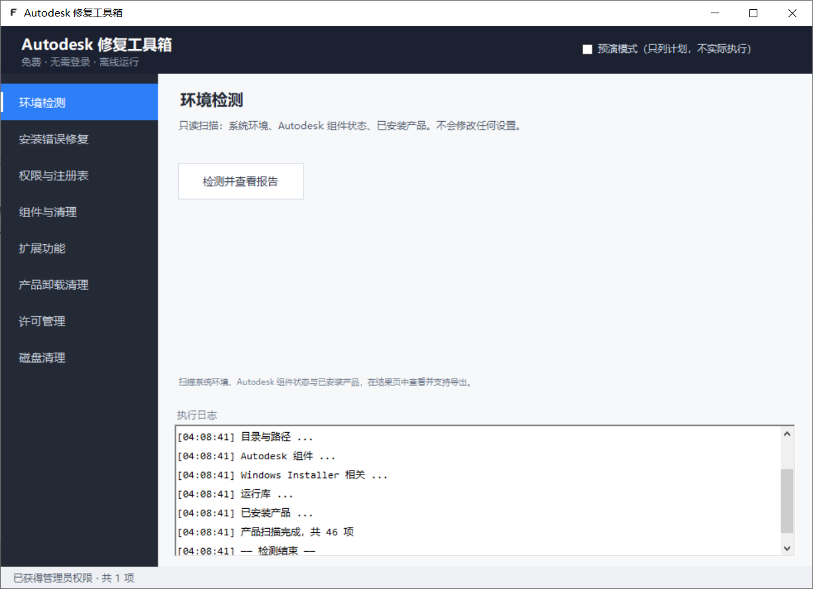
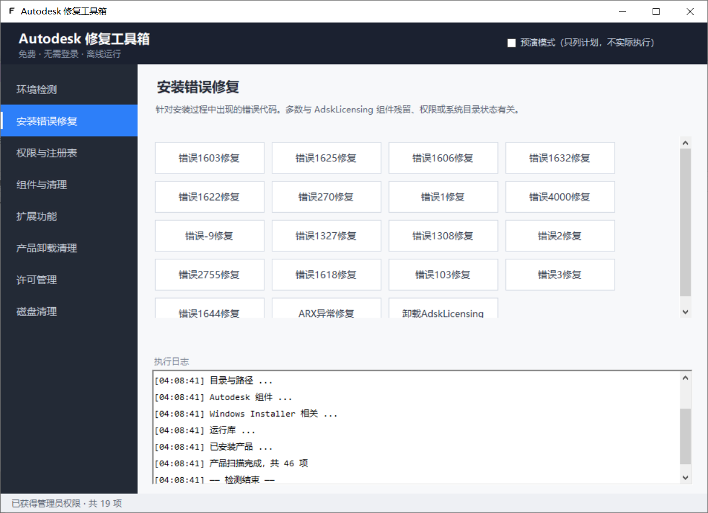
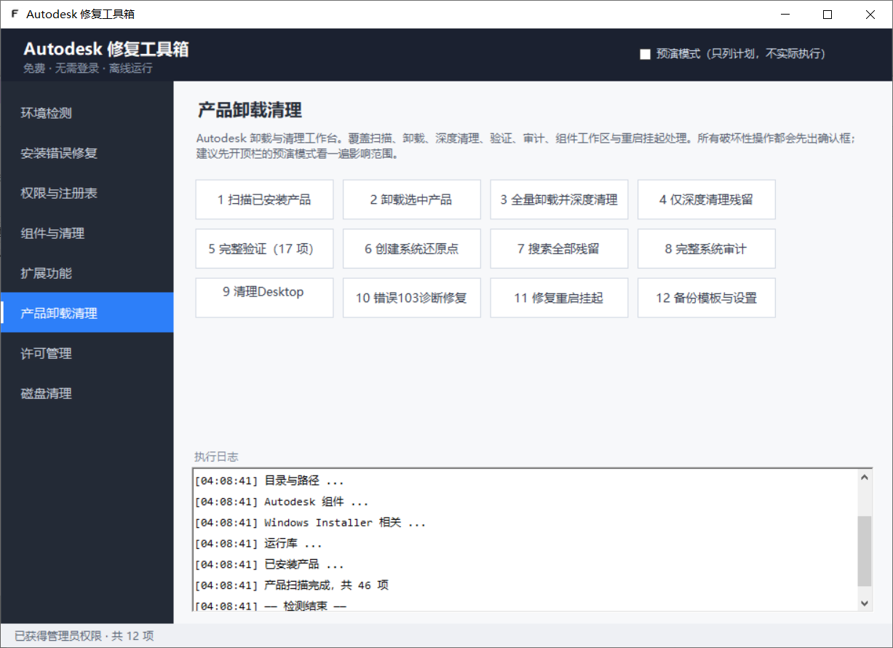
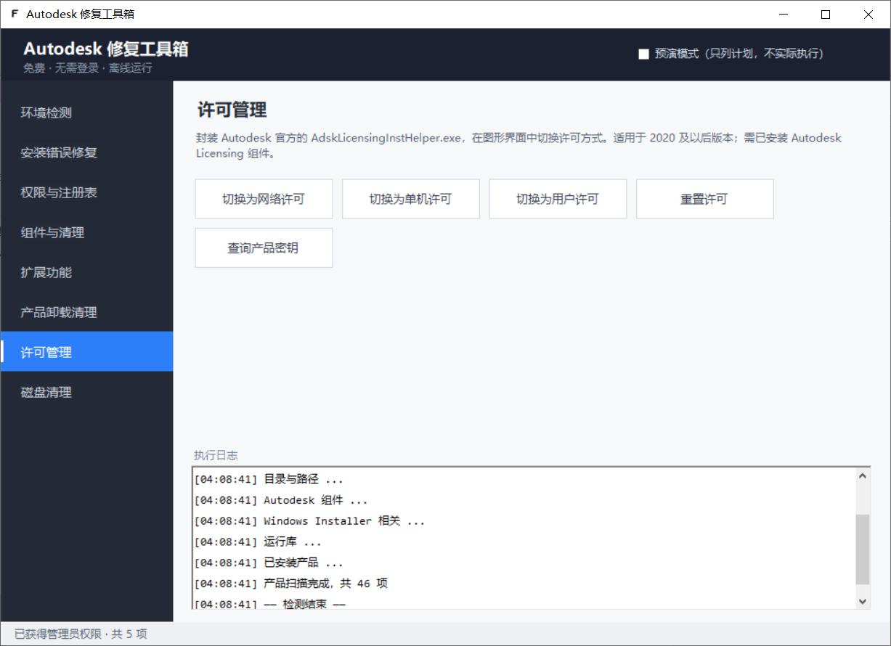

# Autodesk Fix Toolbox v1.0.0

首个公开版本。面向 Windows 的 Autodesk 产品安装故障修复与残留清理工具箱。

**免费 · 完全离线 · 无需登录 · 无授权校验**

> ⚠️ **重要提示**：v1.0.0 尚未在真实机器上完成全量验证，行为描述来自代码实现。
> 请在测试机上确认后再用于生产环境。

## 界面预览

| 环境检测 | 安装错误修复 |
| --- | --- |
|  |  |
| **产品卸载清理**（12 项工作台） | **许可管理** |
|  |  |

## 下载哪一个

| 文件 | 适用环境 | 说明 |
| --- | --- | --- |
| `Autodesk-Fix.exe`（net472 版） | Windows 10 / 11 | 推荐，系统通常已自带 .NET Framework 4.7.2+ |
| `Autodesk-Fix.exe`（net40 版） | Windows 7 SP1 及以上 | 只需 .NET Framework 4.0，兼容性最好 |

> 两个版本的 `Autodesk-Fix.exe` 文件名相同，请按所属文件夹区分（`net472` / `net40`）。

单文件，无第三方 DLL 依赖，复制到任意位置即可运行。

## 亮点

### 应用图标

程序已内嵌自有图标（白底圆角 + 黑色 F 标记），在资源管理器、任务栏与 Alt+Tab 中均可正常显示。
完整图标资源（16 / 24 / 32 / 48 / 64 / 128 / 256 / 512 / 1024 PNG 与 SVG 源文件）位于
`docs/images/icon/`，同样以 AGPL-3.0 发布。

### 预演模式

顶栏开关。开启后所有修复**只输出执行计划，不产生任何实际改动**，日志中每行以
`[预演] 将执行：` 开头，结束时给出操作总数。建议每次正式执行前先跑一遍。

### 只读的安全区

四个模块全程零写入，可以放心先跑：

- 环境检测（6 组 22 项体检）
- 搜索全部残留（15 个维度）
- 完整系统审计（预览完整清理会删掉什么）
- 清理后校验（17 项 / 10 项诊断）

### 破坏性操作逐个确认

- 确认框默认按钮是**「取消」**，误按回车即取消
- 确认框列出**具体**动作：确切的服务名、目录路径、注册表键
- 全量清理、删除 Desktop Connector 工作区等不可恢复操作要求**手动输入 `YES`**

### 共用组件保护

像 FlexNet Publisher 这类被多个厂商共用的组件，会单独列出由你逐项决定，**默认保留**。
参考实现会无条件删除它们，本工具改为显式选择。

## 功能一览

69 项功能，分 8 个分类：

| 分类 | 项数 |
| --- | --- |
| 环境检测 | 1 |
| 安装错误修复 | 19 |
| 权限与注册表 | 7 |
| 组件与清理 | 6 |
| 扩展功能 | 16 |
| 产品卸载清理 | 12 |
| 许可管理 | 5 |
| 磁盘清理 | 1 |

完整说明见 [src/README.md](../src/README.md) 与 [CHANGELOG.md](../CHANGELOG.md)。

## 快速开始

1. 下载并解压（或直接取出 exe）
2. **右键 → 以管理员身份运行**（程序清单已声明提权，双击也会弹 UAC）
3. 首次运行会有 SmartScreen 提示（未签名程序）：选择「更多信息 → 仍要运行」
4. 建议先开**预演模式**，跑一遍目标功能看日志
5. 确认真实执行前，请先创建系统还原点（工作台 #6）

## 安全提示

本工具以管理员权限运行，会停止服务、结束进程、删除文件与注册表项、修改访问权限。

- **在生产环境使用前请先备份**，或在测试机上验证
- 以下两项影响范围可能超出 Autodesk，界面中已单独警示：
  - 「错误 3 修复」按名称特征判断目录
  - 「错误 4000 / -9 修复」会清理 `SOFTWARE\Classes` 下的叶子键
- 需要联网的功能未纳入，程序**不会发起任何网络请求**

## 已知限制

- 本版本尚未在真实机器上完成全量验证，建议先在测试机试用
- CAD 版本降级需要本机已安装 ODA File Converter（程序不下载）
- CAD 文件瘦身需要本机已安装 AutoCAD
- 许可方式切换需要本机已安装 Autodesk Licensing 组件
- 部分安全软件可能对停服务、改注册表权限的行为告警

## 校验下载

```
Autodesk-Fix-net472-v1.0.0.exe
SHA256: B752C5145638FDCCF1C8FEB15EF04C34198F9D01680CA3A628C9776EF9E43D4E

Autodesk-Fix-net40-v1.0.0.exe
SHA256: F2178A6018DA9DA627254690D24A297E3193E8878BA89F86DB59551650E8AD3F
```

Windows 上可用 `certutil -hashfile <文件名> SHA256` 核对下载文件的完整性。

## 许可

GNU AGPL-3.0。第三方来源与许可见 [THIRD-PARTY-NOTICES.md](../THIRD-PARTY-NOTICES.md)。

本项目与 Autodesk, Inc. 无隶属、赞助或背书关系。
